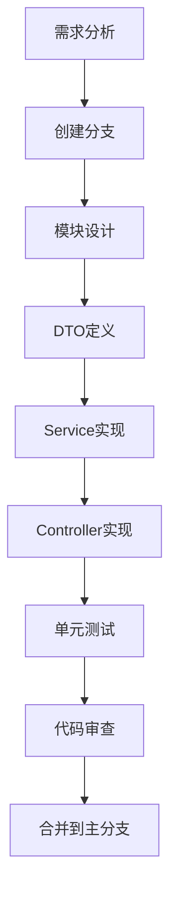
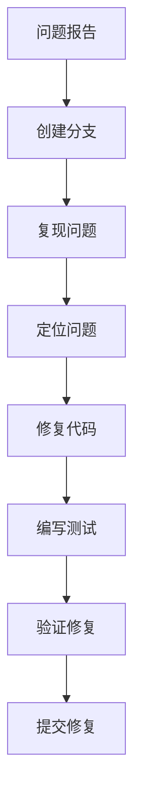

# 微信社交应用后端系统 - 开发者使用手册

## 文档信息

| 项目         | 内容                             |
| ------------ | -------------------------------- |
| **文档名称** | 开发者使用手册 (Developer Guide) |
| **版本**     | v1.0                             |
| **日期**     | 2026-01-08                       |
| **项目名称** | 微信社交应用后端系统             |
| **文档状态** | 正式发布                         |
| **适用范围** | 开发人员、贡献者                 |

## 目录

1. [快速开始](#快速开始)
2. [开发环境搭建](#开发环境搭建)
3. [开发流程](#开发流程)
4. [代码规范](#代码规范)
5. [常用命令](#常用命令)
6. [调试技巧](#调试技巧)
7. [常见问题](#常见问题)
8. [Git工作流](#-git工作流)

---

## 1. 快速开始

### 1.1 快速部署

```bash
# 1. 克隆仓库
git clone <repository-url>
cd chat_backend

# 2. 安装依赖
npm install

# 3. 配置环境变量
cp .env.example .env
vi .env

# 4. 启动Docker服务
cd docker
docker-compose up -d

# 5. 初始化数据库
docker exec -it postgres psql -U chat_user -d chat_backend -f -a docker/postgres/init/01-init.sql

# 6. 启动应用
npm run start:dev

# 7. 访问API文档
open http://localhost:3000/api
```

### 1.2 项目结构

```
chat_backend/
├── docs/                      # 项目文档
├── docker/                     # Docker配置
├── logs/                       # 日志文件
├── src/                        # 源代码
│   ├── common/                 # 公共模块
│   │   ├── database/          # 数据库模块
│   │   ├── redis/             # Redis模块
│   │   ├── guards/            # 守卫
│   │   ├── interceptors/       # 拦截器
│   │   ├── filters/            # 过滤器
│   │   ├── decorators/         # 装饰器
│   │   └── services/          # 公共服务
│   ├── config/                 # 配置管理
│   ├── modules/                # 功能模块
│   │   ├── auth/             # 认证模块
│   │   ├── users/            # 用户模块
│   │   ├── uploads/           # 上传模块
│   │   ├── friends/           # 好友模块
│   │   ├── moments/           # 朋友圈模块
│   │   ├── websocket/         # WebSocket模块
│   │   ├── conversations/    # 会话模块
│   │   ├── chat/             # 聊天模块
│   │   ├── notifications/     # 通知模块
│   │   └── search/           # 搜索模块
│   ├── app.module.ts           # 根模块
│   ├── main.ts               # 应用入口
│   └── ...                   # 其他文件
├── test/                       # 测试文件
├── uploads/                     # 上传文件
├── package.json               # 项目配置
├── tsconfig.json               # TypeScript配置
├── nest-cli.json              # CLI配置
├── .env.example                # 环境变量模板
├── .gitignore                 # Git忽略文件
└── README.md                   # 项目说明
```

---

## 2. 开发环境搭建

### 2.1 前置要求

#### 2.1.1 必需软件

| 软件               | 版本要求                  | 用途                |
| ------------------ | ------------------------- | ------------------- |
| **Node.js**        | >= 18.0.0                 | JavaScript运行时    |
| **npm**            | >= 9.0.0                  | 包管理器            |
| **Docker**         | >= 20.10.0                | 容器化平台          |
| **Docker Compose** | >= 2.0.0                  | 容器编排            |
| **Git**            | >= 2.30.0                 | 版本控制            |
| **VS Code**        | Latest (推荐) 或 WebStorm | IDE                 |
| **Postman**        | Latest                    | API测试工具（可选） |

#### 2.1.2 可选软件

| 软件                | 版本要求 | 用途               |
| ------------------- | -------- | ------------------ |
| **Redis Commander** | Latest   | Redis GUI工具      |
| **TablePlus**       | Latest   | PostgreSQL GUI工具 |
| **MinIO Client**    | Latest   | MinIO GUI工具      |
| **Postman**         | Latest   | API测试工具        |

### 2.2 安装步骤

#### 2.2.1 Windows系统

```bash
# 1. 安装Node.js
# 下载：https://nodejs.org/

# 2. 安装Git
# 下载：https://git-scm.com/

# 3. 安装Docker Desktop
# 下载：https://www.docker.com/products/docker-desktop/

# 4. 安装VS Code
# 下载：https://code.visualstudio.com/
```

#### 2.2.2 macOS系统

```bash
# 1. 使用Homebrew安装
brew install node
brew install git
brew install --cask docker

# 2. 验证安装
node --version
git --version
docker --version
```

#### 2.2.3 Linux系统

```bash
# Ubuntu/Debian
sudo apt-get update
sudo apt-get install -y nodejs npm git

# CentOS/RHEL
sudo yum install -y nodejs npm git

# 安装Docker
curl -fsSL https://get.docker.com -o get-docker.sh
sudo sh get-docker.sh
sudo usermod -aG docker $USER

# 安装Docker Compose
sudo curl -L "https://github.com/docker/compose/releases/download/v2.24.5/docker-compose-$(uname -s)-$(uname -m)" -o /usr/local/bin/docker-compose
sudo chmod +x /usr/local/bin/docker-compose
```

### 2.3 IDE配置

#### 2.3.1 VS Code推荐插件

| 插件名称                | 用途         | 推荐安装 |
| ----------------------- | ------------ | -------- |
| **Prettier**            | 代码格式化   | 是       |
| **ESLint**              | 代码检查     | 是       |
| **TypeScript Importer** | 自动导入     | 是       |
| **Path Intellisense**   | 路径智能提示 | 是       |
| **GitLens**             | Git增强      | 是       |
| **Thunder Client**      | Git客户端    | 是       |

#### 2.3.2 VS Code配置

```json
// .vscode/settings.json 推荐配置
{
  "editor.formatOnSave": true,
  "editor.defaultFormatter": "esbenp.prettier-vscode",
  "editor.codeActionsOnSave": {
    "source.fixAll.eslint": true,
    "source.organizeImports": true
  },
  "typescript.tsdk": "latest",
  "typescript.tsdk.source": "ES2020",
  "files.associations": {
    "*.ts": "typescript",
    "*.js": "javascript",
    "*.json": "json",
    "*.md": "markdown"
  }
}
```

---

## 3. 开发流程

### 3.1 功能开发流程

#### 3.1.1 新功能开发步骤



**详细步骤**：

1. **需求分析**（30分钟）
   - 阅读需求文档（SRS）
   - 确定功能边界
   - 评估技术风险

2. **创建分支**（5分钟）

   ```bash
   git checkout -b feature/new-feature-name
   ```

3. **模块设计**（30分钟）
   - 确定模块结构
   - 定义接口契约
   - 设计数据模型

4. **DTO定义**（15分钟）

   ```typescript
   // 定义请求/响应DTO
   export class CreateDto {
     @IsString()
     name: string;
   }
   ```

5. **Service实现**（60分钟）
   - 实现业务逻辑
   - 编写单元测试
   - 处理错误情况

6. **Controller实现**（30分钟）
   - 定义API端点
   - 添加Swagger注解
   - 实现权限控制

7. **单元测试**（30分钟）

   ```typescript
   describe('Service', () => {
     it('should do something', async () => {
       // 测试逻辑
     });
   });
   ```

8. **集成测试**（30分钟）

   ```bash
   npm run test:e2e
   ```

9. **代码审查**（30分钟）

   ```bash
   npm run lint
   ```

10. **提交代码**（5分钟）

    ```bash
    git add .
    git commit -m "feat: 添加新功能"
    git push origin feature/new-feature-name
    ```

11. **创建PR**（10分钟）

    ```bash
    gh pr create --title "添加新功能" --body "详细描述"
    ```

12. **合并主分支**（5分钟）
    - Code Review
    - 合并到master
    - 删除feature分支

#### 3.1.2 Bug修复流程



**详细步骤**：

1. **创建分支**（5分钟）

   ```bash
   git checkout -b fix/bug-description
   ```

2. **复现问题**（15分钟）
   - 根据问题描述复现bug
   - 确定复现步骤
   - 记录复现日志

3. **定位问题**（15分钟）
   - 阅读相关代码
   - 使用调试器设置断点
   - 分析错误堆栈

4. **修复代码**（30分钟）
   - 修改问题代码
   - 添加边界检查
   - 优化错误处理

5. **验证修复**（15分钟）
   - 运行相关测试
   - 确保问题已解决
   - 确保没有引入新问题

6. **提交修复**（5分钟）
   ```bash
   git add .
   git commit -m "fix: 修复XXX问题"
   git push origin fix/bug-description
   ```

### 3.2 代码质量流程

#### 3.2.1 提交前检查

```bash
# 1. 格式化代码
npm run format

# 2. 代码检查
npm run lint

# 3. 运行测试
npm run test

# 4. 构建项目
npm run build

# 5. 类型检查
npm run type-check  # 如果配置了
```

#### 3.2.2 提交规范

```bash
# 提交信息格式
git commit -m "<type>(<scope>): <subject>"

# Type类型
feat:     # 新功能
fix:      # Bug修复
docs:     # 文档变更
style:     # 代码格式调整
refactor:  # 重构代码
test:      # 测试相关
chore:     # 构建/工具链相关

# Scope范围
auth:      # 认证模块
users:     # 用户模块
chat:      # 聊天模块
...

# 示例
git commit -m "feat(auth): 添加用户注册功能"
git commit -m "fix(chat): 修复消息发送错误"
git commit -m "docs: 更新API文档"
```

---

## 4. 代码规范

### 4.1 命名规范

#### 4.1.1 文件命名

```typescript
// 模块文件：小写短横线
auth.module.ts;
users.service.ts;
messages.controller.ts;

// DTO文件：小写点分隔
create - user.dto.ts;
get - messages.dto.ts;

// 测试文件：小写短横线
auth.service.spec.ts;
messages.controller.spec.ts;
```

#### 4.1.2 变量命名

```typescript
// 常量：全大写短横线
const MAX_FILE_SIZE = 10 * 1024 * 1024;
const DEFAULT_PAGE_SIZE = 20;
const CACHE_TTL = 3600;

// 变量：小驼峰命名
const userName = 'test';
const userId = 'user123';
const createdAt = new Date();

// 私有变量：大驼峰命名，前缀下划线
const UserService = new UserService();
private messageQueue = [];
private readonly logger = new Logger();
```

#### 4.1.3 类名命名

```typescript
// 类名：大驼峰命名
export class UserService {}
export class MessagesController {}
export class NotificationService {}
export interface IMessagePayload {}

// 接口名：大驼峰命名，前缀I
export interface IConfig {}
export interface IMessage {}
export class ApiResponse {}
```

#### 4.1.4 函数命名

```typescript
// 普通函数：小驼峰命名
async getUserInfo(userId: string): Promise<User> {}
async sendMessage(conversationId: string): Promise<void> {}
async validateRequest(request: any): Promise<boolean> {}

// 工具函数：小驼峰命名
function formatDate(date: Date): string {}
function parseToken(token: string): JwtPayload {}

// 异步方法：小驼峰命名，前缀async
async function createUser(userData: CreateUserDto): Promise<User> {}
```

### 4.2 TypeScript规范

#### 4.2.1 类型定义

```typescript
// 避免使用any
// ❌ 错误示例
async function getData(): Promise<any> {}
const user: any = {};

// ✅ 正确示例
async function getUserData(): Promise<User> {}
const user: User | null = null;

// 使用接口定义类型
interface User {
  id: string;
  username: string;
  email: string;
  createdAt: Date;
}

// 使用泛型
interface ApiResponse<T> {
  success: boolean;
  data: T;
  message?: string;
}
```

#### 4.2.2 可空类型处理

```typescript
// 使用可选属性
interface UpdateUserDto {
  username?: string; // 可选
  email?: string;
  nickname?: string;
}

// 使用联合类型
type UserRole = 'admin' | 'user' | 'guest';
type MessageStatus = 'sent' | 'delivered' | 'read';

// 使用非空断言
function processUser(user?: User): User {
  return user || createDefaultUser();
}
```

#### 4.2.3 类型断言

```typescript
// 使用类型断言而不是类型转换
// ❌ 错误示例
const userId = params.userId as string;

// ✅ 正确示例
if (typeof params.userId !== 'string') {
  throw new Error('userId must be a string');
}

// 使用类型守卫
function assertUserId(value: unknown): asserts value is string {
  if (typeof value !== 'string') {
    throw new TypeError('userId must be a string');
  }
}
```

### 4.3 NestJS规范

#### 4.3.1 模块结构

```typescript
// 推荐的模块文件结构
module-name/
├── controllers/
│   └── xxx.controller.ts
├── dto/
│   ├── create-xxx.dto.ts
│   └── update-xxx.dto.ts
├── services/
│   └── xxx.service.ts
├── interfaces/
│   └── xxx.interface.ts
└── index.ts
```

#### 4.3.2 依赖注入

```typescript
// 使用构造函数注入
@Injectable()
export class UserService {
  constructor(
    private db: DatabaseService,
    @Inject(ChatGateway) private chatGateway: ChatGateway,
  ) {}

  // 避免在构造函数中执行耗时操作
  // 耗时操作应该在生命周期钩子中执行
}
```

#### 4.3.3 控制器规范

```typescript
// 使用装饰器
@ApiTags('users')
@Controller('users')
@UseGuards(JwtAuthGuard)
@ApiBearerAuth('JWT-auth')
export class UsersController {
  constructor(private readonly usersService: UsersService) {}

  @Get(':id')
  @ApiOperation({ summary: '获取用户信息' })
  @ApiResponse({ status: 200, description: '获取成功' })
  async getUser(@Param('id') id: string, @CurrentUser() user: any) {
    return await this.usersService.getUser(id);
  }
}
```

#### 4.3.4 服务层规范

```typescript
// 服务应该：
// 1. 包含业务逻辑
// 2. 调用数据库或其他服务
// 3. 抛出适当的异常

@Injectable()
export class MessagesService {
  constructor(private db: DatabaseService) {}

  async sendMessage(
    senderId: string,
    conversationId: string,
    messageData: SendMessageDto,
  ): Promise<Message> {
    // 1. 验证输入
    if (!conversationId) {
      throw new BadRequestException('conversationId is required');
    }

    // 2. 检查权限
    const hasPermission = await this.checkPermission(senderId, conversationId);
    if (!hasPermission) {
      throw new ForbiddenException('No permission');
    }

    // 3. 执行业务逻辑
    const message = await this.createMessage(...);

    // 4. 返回结果
    return message;
  }
}
```

#### 4.3.5 DTO规范

```typescript
// 使用类验证器装饰器
export class SendMessageDto {
  @IsString()
  @MinLength(1)
  @MaxLength(1000)
  content: string;

  @IsUUID()
  conversationId: string;

  @IsEnum(MessageType)
  type: MessageType = MessageType.TEXT;

  @IsArray()
  @IsString({ each: true })
  @IsOptional()
  mediaUrls?: string[];

  @IsUUID()
  @IsOptional()
  replyToId?: string;
}

// 使用Swagger装饰器
@ApiProperty({ description: '会话ID' })
@IsUUID()
conversationId: string;
```

### 4.4 数据库规范

#### 4.4.1 SQL规范

```sql
-- 关键字大写
SELECT id, username, email
FROM users
WHERE status = 'active';

-- 表名小写
SELECT * FROM users;
SELECT * FROM messages;
SELECT * FROM conversations;

-- 列名小写，使用下划线
SELECT user_id, created_at, updated_at
FROM conversations;

-- 使用参数化查询（防止SQL注入）
SELECT * FROM users
WHERE id = $1 AND username = $2;
```

#### 4.4.2 事务处理

```typescript
// 使用事务包装多个操作
async transferMessages(
  fromUserId: string,
  toUserId: string,
  messageIds: string[],
): Promise<void> {
  const client = await this.db.getClient();

  try {
    await client.query('BEGIN');

    for (const messageId of messageIds) {
      await client.query(
        'UPDATE messages SET sender_id = $1 WHERE id = $2',
        [toUserId, messageId],
      );
    }

    await client.query('COMMIT');
  } catch (error) {
    await client.query('ROLLBACK');
    throw new Error('Transfer failed');
  }
}
```

---

## 5. 常用命令

### 5.1 项目管理命令

```bash
# 项目初始化
npm init -y

# 安装依赖
npm install

# 卸级依赖
npm install -g npm@latest

# 查看已安装的包
npm list

# 查看过时的包
npm outdated

# 清理缓存
npm cache clean --force

# 检查依赖安全漏洞
npm audit

# 修复依赖安全漏洞
npm audit fix
```

### 5.2 开发命令

```bash
# 启动开发服务器
npm run start:dev
npm start:debug

# 构建项目
npm run build

# 监听文件变化（需要nodemon）
npx nodemon

# 代码格式化
npm run format

# 代码检查
npm run lint

# 自动修复lint问题
npm run lint -- --fix

# 类型检查
npm run type-check

# 运行测试
npm test
npm run test:watch
npm run test:cov
```

### 5.3 Docker命令

```bash
# 启动所有服务
docker-compose up -d

# 查看服务状态
docker-compose ps

# 查看服务日志
docker-compose logs -f
docker-compose logs -f app

# 停止所有服务
docker-compose down

# 重启服务
docker-compose restart

# 重新构建镜像
docker-compose build

# 查看资源使用情况
docker stats

# 进入容器
docker exec -it app bash

# 查看容器日志
docker logs chat_app

# 复制文件到容器
docker cp local/file.txt chat_app:/app/file.txt

# 从容器复制文件
docker cp chat_app:/app/file.txt local/file.txt
```

### 5.4 数据库命令

```bash
# 连接到PostgreSQL
docker exec -it postgres psql -U chat_user -d chat_backend

# 查看所有表
\dt

# 查看表结构
\d users

# 执行SQL文件
\i /path/to/file.sql

# 导出表结构
pg_dump -U chat_user -d chat_backend > schema.sql

# 备份数据库
pg_dump -U chat_user chat_backend > backup.sql

# 恢复数据库
psql -U chat_user chat_backend < backup.sql
```

### 5.5 Redis命令

```bash
# 连接到Redis
docker exec -it redis redis-cli -a redis_password

# 设置键值
SET key value

# 获取键值
GET key

# 删除键
DEL key

# 查看所有键
KEYS *

# 查看键的TTL
TTL key

# 清空数据库
FLUSHALL

# 查看Redis信息
INFO
```

### 5.6 Git命令

```bash
# 查看状态
git status

# 查看分支
git branch -a

# 创建分支
git checkout -b feature/new-feature

# 切换分支
git checkout master
git checkout develop

# 合并分支
git merge feature/new-feature

# 删除分支
git branch -D feature/new-feature

# 拉日期查看提交
git log --oneline

# 查看文件差异
git diff

# 查看提交详情
git show <commit-hash>

# 查看文件历史
git log --follow -- filename

# 撤销提交（未推送）
git reset --soft HEAD~1

# 查看远程仓库
git remote -v
```

---

## 6. 调试技巧

### 6.1 VS Code调试

#### 6.1.1 断点调试

```typescript
// 1. 在代码行号左侧点击设置断点（红色圆点）
// 2. 按F5启动调试
// 3. 发送请求触发断点
// 4. 使用调试工具：
//    - 变量查看
//    - 调用堆栈
//    - 监视表达式
// 5. 逐步执行（F10/F11）
```

#### 6.1.2 日志调试

```typescript
// 使用Logger记录日志
this.logger.log('User logged in:', userId);
this.logger.error('Database error:', error);
this.logger.warn('Rate limit exceeded:', ip);

// 查看日志输出
console.log('Debug info:', { userId, data });
console.error('Error occurred:', error);
```

#### 6.1.3 启动调试模式

```bash
# 开发调试模式
DEBUG=true npm run start:dev

# 查看所有日志
LOG_LEVEL=debug npm run start:dev

# 查看日志文件
tail -f logs/app.log
```

### 6.2 数据库调试

#### 6.2.1 查看SQL语句

```typescript
// 启用查询日志
this.db.query('EXPLAIN ANALYZE SELECT * FROM users WHERE id = $1', [userId]).then((result) => {
  console.log('Query plan:', result.rows[0]);
});
```

#### 6.2.2 监控连接

```typescript
// 监控数据库连接池
const pool = this.db.getPool();
console.log('Total connections:', pool.totalCount);
console.log('Idle connections:', pool.idleCount);
console.log('Waiting connections:', pool.waitingCount);
```

### 6.3 Redis调试

#### 6.3.1 查看缓存

```typescript
// 查看缓存键
const keys = await this.redisService.keys('*');
console.log('All cache keys:', keys);

// 查看特定缓存
const cachedUser = await this.redisService.get(`user:${userId}`);
console.log('Cached user:', cachedUser);

// 查看缓存TTL
const ttl = await this.redisService.ttl(`user:${userId}`);
console.log('Cache TTL:', ttl);
```

### 6.4 网络调试

#### 6.4.1 测试API接口

```bash
# 使用curl测试
curl -X GET \
  http://localhost:3000/api/users/profile \
  -H "Authorization: Bearer YOUR_TOKEN" \
  -H "Content-Type: application/json" \
  -v

# 使用http测试
http -v GET http://localhost:3000/api/users/profile \
  Authorization:"Bearer YOUR_TOKEN" \
  Content-Type:"application/json"
```

#### 6.4.2 测试WebSocket连接

```javascript
// 使用浏览器控制台
const socket = io('ws://localhost:3001', {
  auth: {
    token: 'your-jwt-token',
  },
});

// 连接成功
socket.on('connect', () => {
  console.log('Connected!');
});

// 监听事件
socket.on('message', (data) => {
  console.log('New message:', data);
});

// 发送消息
socket.emit('send_message', {
  conversationId: 'xxx',
  type: 0,
  content: 'Hello',
});

// 错误处理
socket.on('connect_error', (error) => {
  console.error('Connection error:', error);
});
```

---

## 7. 常见问题

### 7.1 环境问题

#### 7.1.1 端口被占用

**问题**：`Error: listen EADDRINUSE: address already in use :::3000`

**解决方案**：

```bash
# 1. 查找占用端口的进程
# Windows
netstat -ano | findstr :3000

# macOS
lsof -i :3000

# Linux
netstat -tunlp | grep :3000

# 2. 杀进程
taskkill /FIM /PID <pid>

# 3. 或者修改端口
# 在.env文件中修改PORT配置
```

#### 7.1.2 Docker启动失败

**问题**：Docker容器启动失败

**排查步骤**：

```bash
# 1. 查看容器日志
docker-compose logs app

# 2. 检查配置文件
docker-compose config

# 3. 检查依赖服务状态
docker-compose ps

# 4. 查看事件日志
docker events

# 5. 重建容器
docker-compose down
docker-compose up -d --force-recreate
```

#### 7.1.3 数据库连接失败

**问题**：无法连接到PostgreSQL

**排查步骤**：

```bash
# 1. 检查PostgreSQL是否运行
docker ps | grep postgres

# 2. 检查连接配置
# 查看.env文件中的DB_HOST、DB_PORT等

# 3. 测试连接
docker exec -it postgres psql -U chat_user -d chat_backend -c "SELECT 1;"

# 4. 检查网络连接
docker exec -it app ping postgres -c "ping -c 1"

# 5. 查看数据库日志
docker logs chat_postgres
```

### 7.2 编译问题

#### 7.2.1 TypeScript错误

**问题**：类型错误

**常见错误**：

```typescript
// 错误1：Property 'xxx' does not exist on type
// 解决：添加属性到接口或类定义

// 错误2：Type 'string' is not assignable to type 'number'
// 解决：检查类型转换，使用类型断言

// 错误3：Cannot invoke an expression whose type lacks call signature
// 解决：检查函数签名，添加类型定义
```

#### 7.2.2 构建错误

**问题**：npm run build 失败

**排查步骤**：

```bash
# 1. 清理缓存
rm -rf node_modules dist
npm install
npm run build

# 2. 检查TypeScript配置
npm run type-check

# 3. 查看具体错误信息
npm run build 2>&1 | tail -50

# 4. 检查路径别名（tsconfig.json）
# 确保paths配置正确
```

### 7.3 运行时问题

#### 7.3.1 端口无法访问

**问题**：curl: (7) Failed to connect to localhost port 3000

**排查步骤**：

```bash
# 1. 检查应用是否启动
npm run start:dev

# 2. 检查防火墙设置
# Windows: 控制面板 -> Windows Defender防火墙 -> 允许应用
# macOS: 系统偏好设置 -> 安全性与隐私 -> 防火墙选项
# Linux: sudo ufw status

# 3. 检查端口监听
netstat -ano | findstr :3000

# 4. 检查.env配置
cat .env | grep PORT
```

#### 7.3.2 数据库查询慢

**问题**：API响应缓慢

**优化建议**：

```sql
-- 1. 添加索引
CREATE INDEX idx_conversations_user_id_updated
ON conversations(user_id, updated_at);

-- 2. 使用EXPLAIN ANALYZE
EXPLAIN ANALYZE SELECT * FROM messages
WHERE conversation_id = $1
ORDER BY created_at DESC;

-- 3. 优化查询
-- 避免SELECT *
-- 使用分页
-- 使用JOIN替代子查询
```

#### 7.3.3 内存泄漏

**问题**：应用内存持续增长

**排查步骤**：

```bash
# 1. 监控内存使用
docker stats chat_app --no-stream

# 2. 使用Node.js内存分析工具
npm install -g heapdump
node --inspect app.js &

# 3. 生成堆快照
kill -USR2 <pid> -USR1 <pid> node-heapdump.g
```

### 7.4 Git问题

#### 7.4.1 提交被拒绝

**问题**：push被拒绝，提示错误

**解决方案**：

```bash
# 1. 查看远程仓库更新
git fetch origin master
git rebase origin/master

# 2. 解决冲突
git status
git add .
git commit -m "fix: 解决冲突"

# 3. 推送到远程
git push origin master
```

#### 7.4.2 合并冲突

**问题**：合并时产生大量冲突

**解决方案**：

```bash
# 1. 保存当前工作
git stash

# 2. 切换到主分支
git checkout master
git pull origin master

# 3. 切换回feature分支
git checkout feature/new-feature

# 4. 变基主分支
git rebase master

# 5. 解决冲突
# 编辑冲突文件，保留需要的代码

# 6. 继续变基
git rebase --continue

# 7. 完成变基
git rebase --continue

# 8. 强制推送（如果需要）
git push origin feature/new-feature --force-with-lease
```

### 7.5 测试问题

#### 7.5.1 测试失败

**问题**：npm test 失败

**排查步骤**：

```bash
# 1. 清理缓存
rm -rf node_modules
npm install

# 2. 更新测试依赖
npm update

# 3. 单独运行失败的测试
npm test -- -- testPathPattern=auth.service.spec.ts

# 4. 使用--verbose查看详细输出
npm test -- --verbose

# 5. 运行覆盖率报告
npm run test:cov
```

---

## 8. Git工作流

### 8.1 分支策略

#### 8.1.1 主要分支

| 分支           | 用途         | 保护规则                         |
| -------------- | ------------ | -------------------------------- |
| **master**     | 生产环境     | 只能通过PR合并                   |
| **develop**    | 开发集成分支 | 每周合并到master一次             |
| **feature/\*** | 功能分支     | 从develop创建，完成后PR到develop |
| **fix/\***     | Bug修复分支  | 从develop创建，完成后PR到develop |
| **hotfix/\***  | 紧急修复     | 直接PR到master或develop          |

#### 8.1.2 分支命名

```bash
# 功能分支
feature/add-chat-feature
feature/user-search

# Bug修复分支
fix/login-error
fix/database-connection

# 紧急修复分支
hotfix/critical-security-fix
```

### 8.2 Pull Request规范

#### 8.2.1 PR标题

```markdown
feat: 添加群聊功能

## 变更描述

### 功能特性

- 支持创建群聊
- 支持添加/移除成员
- 支持群聊消息广播

### 技术细节

- 使用ConversationsModule
- 集成WebSocket实时通知
- 使用PostgreSQL存储群聊数据
```

#### 8.2.2 PR检查清单

```markdown
- [ ] 代码通过lint检查
- [ ] 所有测试通过
- [ ] 添加了必要的单元测试
- [ ] 更新了相关文档
- [ ] 添加了API文档注解
- [ ] 没有console.log残留
- [ ] 遵循代码规范
- [ ] 更新了README（如果需要）
```

#### 8.2.3 Code Review要点

```markdown
- 代码逻辑是否正确
- 是否有性能问题
- 是否有安全漏洞
- 错误处理是否完善
- 代码是否易于维护
- 是否符合项目规范
```

### 8.3 Commit规范

#### 8.3.1 Commit Message格式

```bash
# 格式
<type>(<scope>): <subject>

<body>

# 示例
feat(auth): 添加用户注册功能

- 实现用户注册API
- 添加密码加密
- 添加邮箱验证
- 集成单元测试

Closes #123
```

#### 8.3.2 Commit Body示例

```markdown
# 详细描述变更内容

## 变更类型

- 新功能
- Bug修复
- 文档更新
- 重构
- 性能优化
- 代码规范调整

## 详细描述

具体的变更内容描述...

## 测试

- 添加了单元测试
- 测试覆盖率：85%

## 相关Issue

Closes #123
Closes #456
```

---

## 附录

### A. 相关链接

| 文档                   | 路径                                          |
| ---------------------- | --------------------------------------------- |
| 需求规格说明书 (SRS)   | /docs/requirements/srs.md                     |
| 系统架构设计文档 (SAD) | /docs/design/system-architecture.md           |
| 数据库设计文档         | /docs/design/database-design.md               |
| 详细设计文档 (DD)      | /docs/design/detailed-design.md               |
| 部署文档和运维手册     | /docs/deployment/deployment-and-operations.md |
| API接口文档            | http://localhost:3000/api                     |

### B. 常用资源

| 资源           | 链接                             |
| -------------- | -------------------------------- |
| NestJS文档     | https://docs.nestjs.com/         |
| TypeScript文档 | https://www.typescriptlang.org/  |
| PostgreSQL文档 | https://www.postgresql.org/docs/ |
| Redis文档      | https://redis.io/documentation   |
| Docker文档     | https://docs.docker.com/         |
| Socket.IO文档  | https://socket.io/               |
| Swagger文档    | https://swagger.io/              |
| MinIO文档      | https://min.io/docs/             |

### C. 团队协作

- **Code Review**: 所有PR需要至少1人Review
- **测试覆盖率**: 目标80%以上
- **文档更新**: 新功能必须更新相关文档
- **部署验证**: 所有PR部署到测试环境验证

---

**文档结束**
